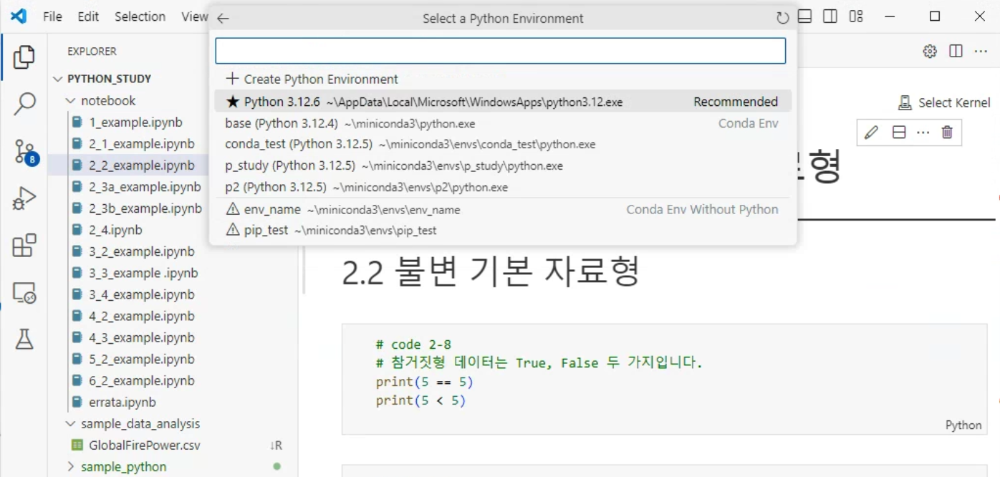

# 실습 관련 이슈 해결에 대하여

## 빠른 해결 방법

- 이 방법은 윈도우 터미널을 사용하지 않습니다.
- 미니콘다를 설치하면 기본 설치되는 아나콘다 프롬프트(anaconda prompt)를 활용합니다.


- 아나콘다 프롬프트 환경에서 다음과 같이 가상 환경을 생성 할 수 있습니다.
  - `...> conda create -n env_name`


- visual studio code에서 아나콘다 프롬프트 환경에서 생성한 가상 환경을 사용할 수 있습니다. 예를 들어 아래 그림은 노트북에서 커널을 선택할 때, 생성한 가상 환경을 선택하는 상황의 예시입니다. 목록 제일 아래에 예시로 생성한 env_name 가상환경이 있습니다.



- 노트북을 실행하다가 특정 모듈 (예를 들어 matplotlib)가 필요하면 다음과 같이 오류가 발생할겁니다.


- 이 경우 아나콘다 프롬프트에서 패키지를 추가 실행하면 됩니다.
- 단 설치할 때의 가상환경이 반드시 생성한 가상 환경 (예를 들어 env_name) 이어야 합니다. 다른 가상환경에서 설치하면, 커널에 선택한 가상환경에서는 이 패키지를 사용할 수 없습니다.
  - `...> conda activate env_name`
- 다음 스크린샷은 아나콘다 프롬프트에서 가상 환경을 활성화하는 예시입니다.


- 이렇게 활성화 한 다음에 필요한 패키지를 설치해야 합니다.


- 실습을 위해서 설치해야 하는 외부 패키지는 다음과 같습니다.
  - pandas - `conda install pandas`
  - numpy - pandas를 설치하면 자동으로 설치됩니다. 별도로 설치하려면 `conda install numpy`로 설치할 수 있습니다.
  - statsmodels - `conda install statsmodels`
  - seaborn - `cona install seaborn`
  - scipy - statsmodels를 설치하면 자동으로 설치됩니다. 별도로 설치하려면 `conda install scipy`로 설치할 수 있습니다.

## 주피터 노트북 실행 관련

- Visual Studio Code에서 ipynb 파일을 오픈한 후 커널을 선택하면, 자동으로 필요한 패키지를 설치합니다. 다만 일부 버전, 일부 환경, 또는 그 시점에 인터넷 연결이 되어 있지 않은 경우 등의 상황에 이 작업이 자동으로 진행되지 않는 것 같습니다. 이 경우 인터넷이 연결된 환경의 아나콘다 프롬프트에서 다음을 입력해 보세요. 아래 `-n env_name`은 각자 실습에 사용할 가상 환경 이름을 사용해야 합니다.

  - `conda install -n ctest ipykernel --update-deps --force-reinstall`

## 터미널로 실행한 파워셸과 아나콘다 프롬프트의 차이

- 윈도우 10 또는 윈도우 11에는 두 종류의 명령행 프롬프트가 있습니다. 하나는 파워셸이고 하나는 명령 프롬프트인데, 아나콘다 프롬프트는 명령 프롬프트 기반으로 동작합니다.
  - 실행중인 명령행 프롬프트가 파워셀인지 명령 프롬프트인지를 구분하려면 화면에 PS가 출력되는지를 확인하면 됩니다.
  - 파워셸로 동작하는 터미널 앱의 경우


- 명령 프롬프트로 동작하는 아나콘다 프롬프트의 경우


- 파워셸의 사용법은 별도로 공부하셔야 하지만, 명령 프롬프트와 파워셸의 차이를 간단하게 설명하면 다음과 같습니다.

| 차이점                      | 명령 프롬프트                               | 파워셸                                      | 호환 | 비고                                                                                                                     |
| --------------------------- | ------------------------------------------- | ------------------------------------------- | ---- | ------------------------------------------------------------------------------------------------------------------------ |
| 현재 디렉토리 표시          | `cd`                                        | `pwd`                                       | X    |
| 디렉토리 변경               | `cd 경로`                                   | `Set-Location 경로`                         | O    |
| 디렉토리의 내용을 보는 명령 | `dir`                                       | `ls`                                        | O    |
| 파일 복사                   | `copy 원본 목적`                            | `Copy-Item 원본 목적`                       | O    | `목적`이 존재하는 디렉토리이면 디렉토리에 같은 이름으로 복사, 그 이외의 경우는 `목적`의 이름으로 파일 이름을 바꾸어 복사 |
| 파일 이동                   | `move 원본 목적`                            | `Move-Item 원본 목적`                       | O    | 상동                                                                                                                     |
| 파일 생성                   | `copy con 파일이름`                         | `New-Item 파일이름 -ItemType File`          | X    |
| 파일 삭제                   | `del 파일이름`                              | `Remove-Item 파일이름`                      | O    |
| 텍스트 파일 내용 보기       | `type 파일이름`                             | `Get-Content 파일이름`                      | O    |
| 디렉토리 생성               | `mkdir 디렉토리이름` 또는 `md 디렉토리이름` | `New-Item 디렉토리이름 -ItemType Directory` | O    |
| 디렉토리 삭제               | `rmdir 디렉토리이름` 또는 `rd 디렉토리이름` | `Remove-Item 디렉토리이름`                  | O    | 파워셸 `Remove-Item` 명령의 경우 `-Recurse` 옵션을 추가하면 하위 디렉토리도 삭제 가능                                    |
| 실행중인 프로세스 확인      | `tasklist`                                  | `Get-Process`                               | O    |

- 명령어 입력시 대소문자는 꼭 구분해 입력할 필요는 없습니다.
- 호환의 의미는 명령 프롬프트에서 사용할 수 있는 명령을 같은 용도로 파워셸에서 사용할 수 있는지의 여부입니다.
  - 예를 들어서 명령 프롬프트의 `tasklist`는 파워셸에서 사용할 수 있습니다.
  - 하지만 명령 프롬프트의 현재 디렉토리를 확인하는 명령 `cd`는 파워셸에서 다른 방식으로 동작하며
  - 명령 프롬프트의 `copy con 파일이름`은 파워셸에서는 사용할 수 없습니다.
  - 파워셸의 명령은 명령 프롬프트에서는 사용할 수 없습니다.

## 권한 문제로 터미널 앱에서 미니콘다 실습환경을 구성할 수 없는 경우

- 파워셸을 실행합니다. (설치한 터미널앱을 실행했을 때 PS가 찍히는 환경 또는 Windows PowerShell 앱을 실행합니다.)
- 다음 명령을 실행해봅니다.
  - `Get-ExecutionPolicy` (입력할 때 대소문자는 꼭 구분해 입력할 필요는 없습니다.)
- 결과는 다음 중 하나입니다.
  - `Restricted`
  - `AllSigned`
  - `RemoteSigned`
  - `Unrestrictede`
  - `Bypass`
- 만약 결과가 Restricted 또는 AllSigned인 경우 다음과 같이 실행 권한을 변경합니다.
  - `Set-ExecutionPolicy RemoteSigned -Scope CurrentUser`
  - 만약 여러 사람이 사용하는 컴퓨터이고, 모든 사용자에게 같은 권한을 부여하려면 `CurrentUser` 대신 `LocalMachine`으로 바꾸면 됩니다.
  - 변경 시에 권한이 필요하다고 요청할 수 있습니다. 만약 "관리자 권한으로 실행"해야 한다는 오류 메시지가 나오면 실행 중인 파워셸을 관리자 권한으로 실행해야 합니다.
    - 관리자 권한으로 실행하는 방법은 앱을 실행할 때 바로 클릭하는 대신 마우스 오른쪽 클릭을 하면 메뉴가 나오고, 이 메뉴에서 관리자 권한 실행 여부를 선택할 수 있습니다.


# 데이터 실습 관련 팁

## `matplotlib`의 한글 관련 이슈

- `matplotlib`에서 한글로 그래프 제목 등을 붙이려고 하면 정상적으로 처리되지 않을 수 있습니다. 이는 폰트 문제로 별도로 한글 출력이 가능한 폰트를 지정해 주어야 합니다.
- 폰트 지정은 다음과 같이 할 수 있습니다.

```python
import matplotlib.pyplot as plt
from matplotlib import font_manager, rc
rc("font", family="Malgun Gothic")  # 맑은 고딕 폰트
# 한글 폰트 설정 시 - 부호에 문제가 될 수 있습니다. 이를 방지하기 위함입니다.
plt.rcParams['axes.unicode_minus'] = False
```
