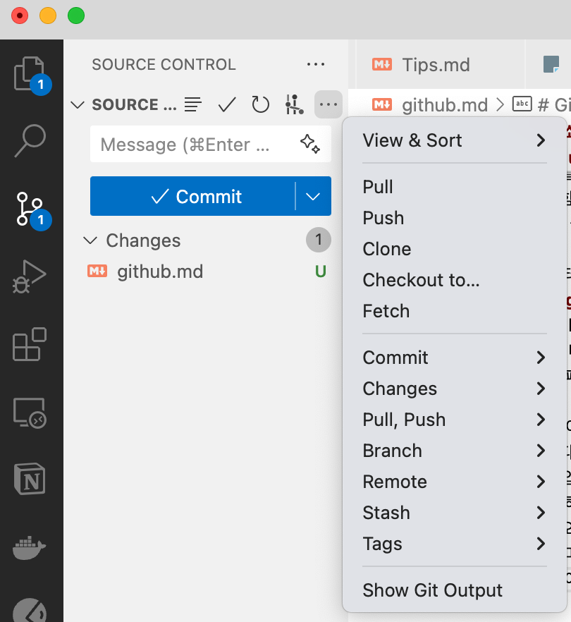
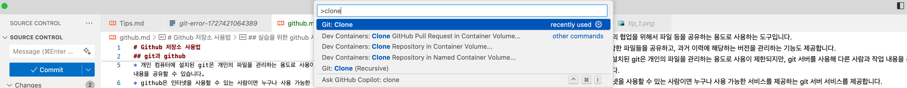

# Github 저장소 사용법

## git과 github

- git은 개발자들의 협업을 위해서 파일 등을 공유하는 용도로 사용하는 도구입니다.
- 소스코드를 포함한 파일들을 공유하고, 과거 이력에 해당하는 버전을 관리하는 기능도 제공합니다.
- 개인 컴퓨터에 설치된 git은 개인의 파일을 관리하는 용도로 사용이 제한되지만, git 서버를 사용해 다른 사람과 작업 내용을 공유할 수 있습니다.
- github은 인터넷을 사용할 수 있는 사람이면 누구나 사용 가능한 서비스를 제공하는 git 서버 서비스를 제공합니다.

## 실습을 위한 github 사용법

- git과 github 사용법을 모두 알려드리는게 이 문서의 목적은 아닙니다. 이 문서 이상의 내용이 필요하다면, 별도로 찾아보시기 바랍니다.
- 이 깃허브 웹 페이지에 접속하면 상단에 "Code" 버튼이 있습니다. 이 버튼을 클릭하면 HTTPS와 GitHub CLI 두 개의 탭이 보입니다.
  - 깃허브 계정이 있는 사람이 로그인한 상태에서는 조금 다르게 보일 수 있습니다. 다만, 다음 설명을 이해하는데는 문제가 없는 차이입니다.
- HTTPS 아래 입력이 되지 않는 인터넷 주소가 적혀 있는 칸이 보이고 그 옆에 네모 두 개가 겹쳐 있는 아이콘이 있습니다. 그 아이콘을 클릭하면 옆 인터넷 주소가 클립보드에 복사됩니다. (즉 CTRL+C를 누른 상태가 된다는 의미입니다.)
- 비주얼 스튜디오 왼쪽 버튼 모음 중 "Source Control"이라는 이름의 버튼이 있습니다. 이 버튼을 클릭한 후, 다음 그림을 참고해서 마우스를 적당한 위치에 이동하면 버튼이 보이고, 버튼을 클릭하면 메뉴가 나옵니다. (마우스가 다른 위치에 있으면 버튼이 보이지 않습니다.) 이 메뉴에서 clone을 선택합니다.

- 또는 비주얼 스튜디오 코드의 명령 팔레트에서 ">clone"이라고 입력을 하면 Git: Clone 항목이 나옵니다.

- 이후 나오는 입력창에 CTRL+V로 붙여넣기를 하면, 디렉토리를 선택하라고 합니다. 선택한 디렉토리에 저장소에 있는 파일을 모두 내려받을 수 있습니다.
- 한번 내려받은 파일은 수정 후 정해진 절차 및 규칙에 따라 저장소에 다시 올릴 수 있습니다만, 만약 그렇게 하시길 원한다면 각자 계정을 생성한 후, 제 저장소를 여러분의 계정에 포크해서 저장소를 생성한 후 그 곳에서 하셔야 합니다. 이 부분에 대한 자세한 설명은 생략하겠습니다.
- 만약 제가 파일을 수정하거나 추가한 경우, 이때 변경된 부분만 내려받고 싶으신 경우 첫 번째 그림의 메뉴에서 pull을 선택하거나, 명령 팔레트에서 >pull을 입력해 Git: Pull을 선택하시면 됩니다.
  - 단, 파일 중 일부가 저도 수정하고 여러분도 수정해서 충돌이 나는 경우 "Pull"이 실행이 되지 않을 수 있습니다. 이 경우, 충돌이 발생한 파일을 백업한 후 삭제하신 후 다시 시도해 보시거나 git을 따로 공부하셔서 (당장 가르쳐 드릴 수 있는 내용이라면 바로 여기 쓰겠습니다만, 어렵지는 않지만 양이 좀 많습니다.) 충돌을 해결하시면 됩니다.

## github과 관련된 이슈가 있다면

- 이 저장소에 올려져 있는 파일 또는 github 사용과 관련해서 이슈가 있으면 다음과 같이 해 보세요
  - github에 로그인 합니다.
  - 상단 메뉴에 보시면 Issues 메뉴가 있습니다. 이를 클릭합니다.
  - 들어간 페이지에서 New Issue 버튼을 클릭합니다.
  - Add a title에 제목을, 그리고 Add a description에 이슈의 내용을 기재해주세요.
  - 오른쪽에 Labels에서 이슈에 꼬리표를 붙일 수 있습니다. 적당한 꼬리표를 찾아 붙여 주세요
    - 제 노트북에 문제가 있으면 bug를
    - 도움이 필요하시면 help wanted를
    - 질문은 question 꼬리표를 사용해 주시면
  - 도움이 될 수 있습니다.
